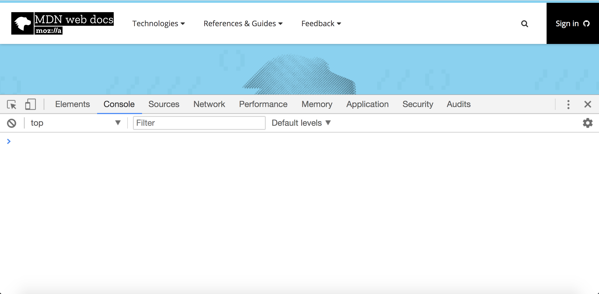
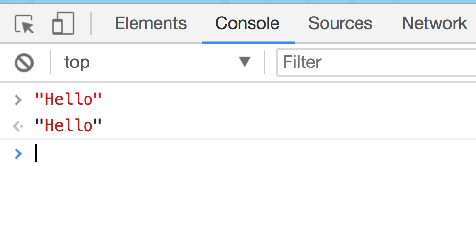
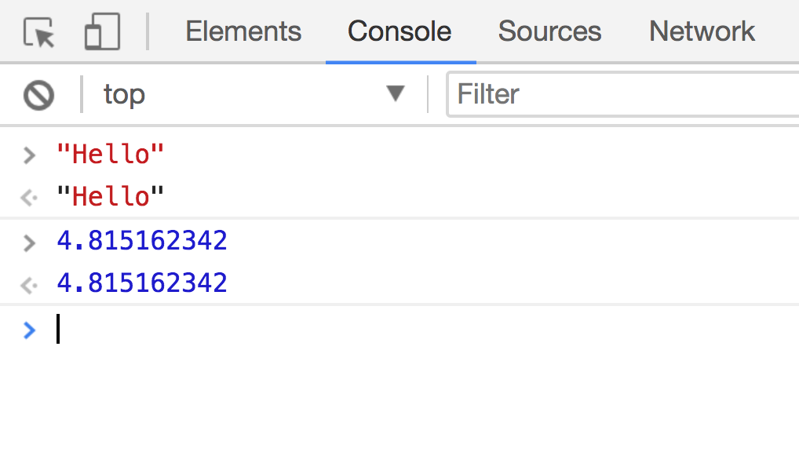
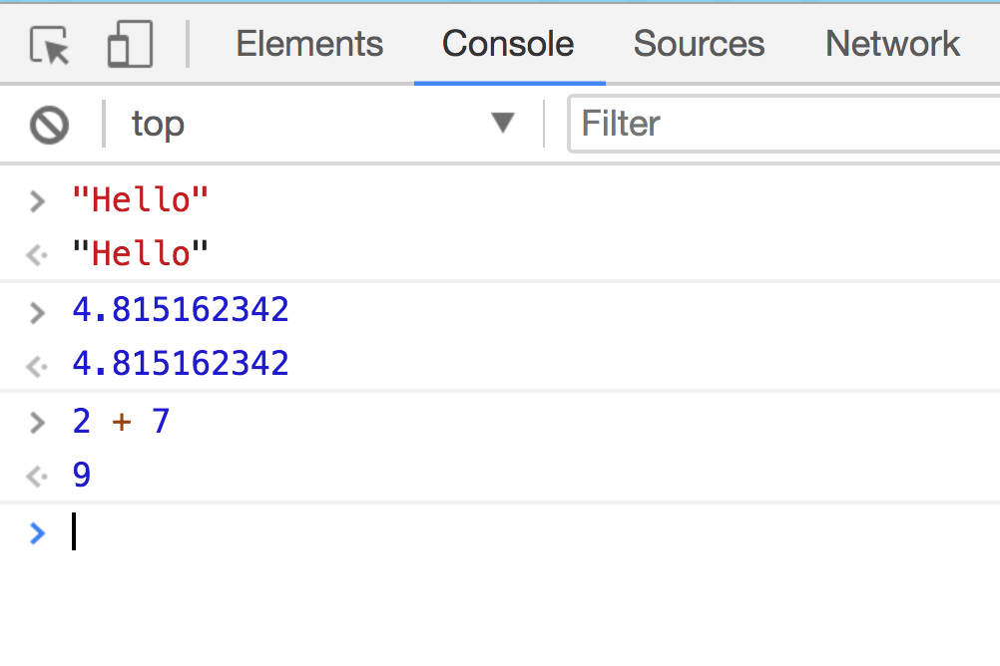
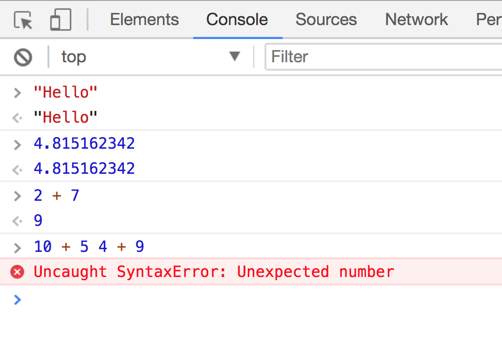
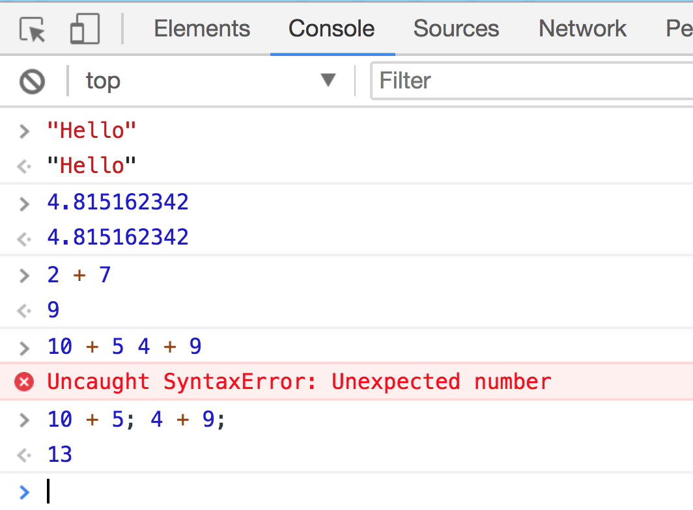

# Expressions

## Instructions

* Explain to the class that like HTML and CSS, we don’t need anything other than a web browser to begin writing JavaScript code.

* But before building complete applications, we're going to explore some fundamental concepts.

* Open your Chrome Devtools and open the Console Tab (CMD + Option + J) on a Mac or (Control + Shift + J) on PC.

  

* Explain to the class that we’ll be using the Chrome console frequently as it will inform us of errors in our JavaScript code. It should be the first place we check if our code isn't working as expected.

* Type the following into your console and hit Enter

```js
“Hello”
```

  
  
* Explain that in addition to being a powerful debugging tool, the `Console` serves a similar purpose to the `Elements` tab in Chrome: it allows us to interact with JavaScript code being run by a website, as well as inject some of our own.

* We should see the word “Hello” printed right below where we’ve typed it.

* By entering the text "Hello" in the console, we're telling Chrome that we want to evaluate this as JavaScript code.

* Explain that JavaScript understands the concept of Strings, i.e. a sequence of characters.

* Explain that JavaScript also understands the concept of numbers

* Type the following (or any number) in your console:

```js
4.815162342
```

  

* Point out how the console prints the value back at us, but in a different color. 

	* This blue color signifies that the type of data we’re working with is different from the string “Hello” we typed earlier. It’s a number!

* Point out how so far the values we’ve typed into the console have been printed back at us. Ask the class: “Why do you think this is happening? What does it mean?”

	* Take a moment to hear a few answers. The most likely conclusion should be that the console prints back whatever it is we type in.

* Have the following ready to type into the console

```js
2 + 7
```

  

* Ask the class: “What do you think will happen here? What will get printed back from the console? Will it print ‘2 + 7?’ or something else?”

	* Take a quick poll and hit the Enter key. The output should be 9.

* Explain to the class that the console prints back the value of the last expression we type in.

	* An expression can be a single value, such as a string or a number, or it can also be a statement, i.e. instructions composed of one or more expressions. All expressions resolve to a single value in JavaScript.

* Ask the class what they expect to happen when we type the following into the Chrome Console?

  ```js
  10 + 5 4 + 9
  ```

  

  * We get an error! `Uncaught SyntaxError: Unexpected number`

* Explain that unlike HTML and CSS, JavaScript will let us know if we've done something wrong in the form of error messages.

* Ask the class: “Which number do you think is the unexpected one?”

	* The number 4. The same way a calculator wouldn’t know what to do with this, JavaScript doesn’t either. 

* What we really want here are two separate statements: 

	* `10 + 5` and then `4 + 9` on the next line

* Point out that typing the following and hitting Enter:

```js
10 + 5
```

* And then doing this:

```js
4 + 9
```

* Would work without any issues.

* But so would this:

```js
10 + 5; 4 + 9;
```



* The Chrome Console should print back `13`, the value of the last expression we typed in. 

* Inform the class that semi-colons in JavaScript signify the end of a statement. So by adding one between the two statements, we can write them both on the same line and not confuse our browser.

* Explain that when we start writing complete JavaScript applications, we’ll generally write one statement, or instruction per line and throw one semi-colon at the end.

* Now that we know that JavaScript understands math, we can use it as a calculator!
