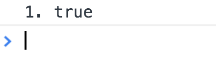
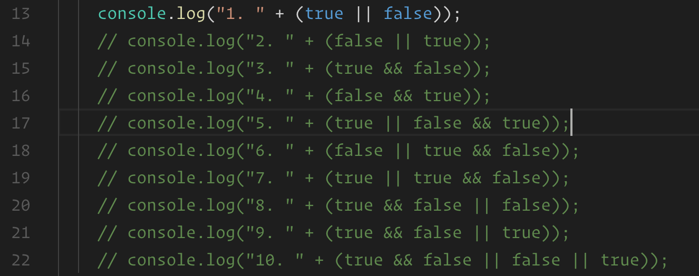

# Short Circuit

In this activity, we will demonstrate the short circuit evaluation for students. It may not be immediately apparent why this is important, but inform students that it's a fundamental part of control flows in JavaScript, e.g. customizing our programs to perform different actions based on certain conditions.

## Instructions

* Open [index.html](index.html) in your web browser and open the console.

  

* Now open [index.html](index.html) in your editor and demonstrate the code.

  

* Explain that while we've covered the arithmetic operators in JavaScript, there are two **logical** operators we need to know about.

* Point out the double pipes (`||`) in the first `console.log` statement. Explain that this is known as the **logical OR operator**.

  * Tell the class that the OR operator `||` means that the expression will evaluate to `true` if the value on the left side **OR** the value on the right side of the double pipe, or both, evaluates to `true`.

  * In order to check for understanding so far, have the class explain back to you why `true` is logged in the first `console.log` statement.

* Now uncomment the second example. Before running the code in your web browser, ask the class: "What should be printed in the second statement?"

  * Explain that if the value on the left hand side of the logical OR operator is `true`, the value on the right will not be evaluated because we only need one value to be true. But if the value on the left hand side is `false`, the expression on the right hand side of the logical OR operator is evaluated.

  * `true` should be printed again. Since the value on the left hand side of the logical OR is `false`, it uses the value on the right side instead.

* Run the code and demonstrate the second example.

* Now uncomment the third example and explain that the double ampersand (`&&`) is the logical AND operator.

  * Explain that an expression with `&&` requires **both** the value on the left and the right to be true in order for the whole expression to evaluate to true.

* Explain that if the value on the left hand side of the operator is `false`, then it is used. Otherwise if the value on the left hand side of the operator is `true`, then the second value is used.

* Logical AND wants to check both values, but doesn't bother if the first value is `false`, it just uses that. Whereas logical OR wants to use the first `true` value it finds &mdash; wherever that is &mdash; but settles for the last value if there is none.

* Ask the class, "If logical AND wants to check both values, but stops at the first `false` value, what does statement number 3 log?"

  * `false`! Since the first value was `true`, it continued to check the second value and used that.

* Uncomment statement number 4 and ask the class, "What logs here?Remember that logical AND wants to check both values, but stops at the first `false` value it finds."

  * `false`! It stopped at the first `false` value it found and didn't bother to check the second value.

* Uncomment statements 5 and 6 and ask the students to walk you through what happens in each example and what they expect the output to be before you run it.

* Ask the class to think of *why* we might use logical operators? Give them a minute to think of some ideas and, if necessary, discuss the answer below or your own example.

  * **ANS:** Imagine we are building a contact form for a customers website and we want to make sure that users can only submit the form **if** the user fills out the email field **AND** types a message in the message area. We would use the `&&` operator to write this logic.

  * **ANS:** Imagine that we are building an e-commerce site have a special savings code available to gold and platinum level members but not standard members and non-members. When a user logs in we would check to see if their membership type was gold **OR** platinum, and if so, we would display the special code. For this we would use the `||` operator.  

* Before we can become JavaScript Ninjas, we must first master the fundamentals, even if they aren't as fun as some of things we want to jump into right away.

    
