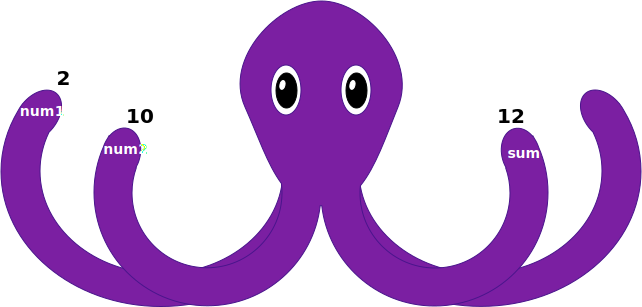

# Prompt Alert

## Instructions

* Inform the class that now that we have some exposure working with expressions in the console, we're going to write and save some JavaScript code inside of an HTML document.

* Explain that in the same way we can write CSS code within our HTML documents using the `style` tags, we can write JavaScript code in our HTML using the `script` tags.

* Demonstrate the [index.html](index.html) file to the class and highlight the code inside of the `script` tags.

* Have a volunteer explain to you what they think will happen when we run the code.

  ```js
    var greeting = prompt("enter your name");
    alert("Hello " + greeting);
  ```

  * After spending a few minutes as a class brainstorming what the code _might_ do, go ahead and open the HTML file in your web browser.

  * Explain that `prompt` is a **function** built into JavaScript.

    * Explain that a function is a just a named section of pre-written code that we can run whenever we want just by writing the functions name followed by parentheses `prompt()`.

    * We can also pass values to the function that we want it to use. The values that we "pass" to a function are called arguments. In the example above, `var greeting = prompt("enter your name");` the argument is `"enter your name"`. Our arguments always appear inside the parenthesis.

    * Reassure students that we will cover functions in-depth soon, so it's okay  if all this terminology doesn't make sense right now.

    * The important thing to understand is that the `prompt` function opens a pop-up dialogue in the web browser and prompts the user for some input. The string we pass in as an argument is used inside of the pop-up dialogue.

  * Ask the class: "What do you think happens to the value we type into the prompt window? Does it get stored anywhere?"

    * **Ans:** It gets stored in the variable `greeting`.

---

## Let's take a moment to review Variables

* Variables are initially created using the `var` keyword, but are later accessed just using their names.

* An analogy that may help students visualize variables:

  * There's a giant octopus with many tentacles which we must name before using. Once named, each tentacle can hold on to a single item. When we want to hold on to a new item, we designate the name of the tentacle that should hold it. And when we want to access an item, we refer to the name of the tentacle thats holding it.

  * So writing `var num1 = 2` is like naming a tentacle `num1` and then having that tentacle hold the number `2`. Writing `num1` later in our code is like asking the octopus to hand us whatever the `num1` tentacle is holding.

  * In this analogy, "tentacles" are variables, and the "items" are their values. And while we aren't there quite _yet_, the Octopus can be thought of as the Window or global object.

    
---

* Explain to the class that functions can accept some input (the arguments we pass between the parentheses). And they can also output (or **return**) a value as well.

  * In the case of the `prompt` function, it takes the text to be displayed as input, and produces the value typed in by the user as output.

* The following code:

  ```js
  var greeting = prompt("enter your name");
  ```

* Prompts the user for a name, and returns the value they type in. The value that is  returned is then assigned to the variable `greeting`.

* Now go over the next section of code:

```js
alert("Hello " + greeting);
```

* Point out the `alert` function call. Similar to `prompt`, `alert` throws up a pop-up dialogue but doesn't take any user input &mdash; it just displays the message we pass in.

* Answer any questions about this activity before going on to the next example!
