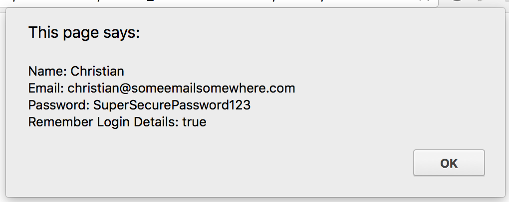

# Collect User Details

In this activity we will collect some information from the user using prompt and confirm dialogues, and alert the information back at the user.

## Instructions

* Update the `script` tag in [index.html](Unsolved/index.html) to use `prompt` to collect the following information from the user:

  1. Their name
  2. Their email address
  3. A password (should be fake)

* Then use the [confirm dialog](https://www.tutorialspoint.com/javascript/javascript_dialog_boxes.htm) to ask the user if they would like their login credentials to be remembered.

* Store each value inside of a variable. Once each value has been collected, use an alert dialogue to display all of the information back to the user.

### Hints

* You will need to look into the `confirm` function. See examples for [prompt, confirm, and alert](https://www.tutorialspoint.com/javascript/javascript_dialog_boxes.htm).

* Typing "\n" inside of a string will force a linebreak.
