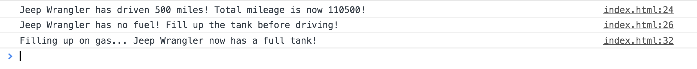
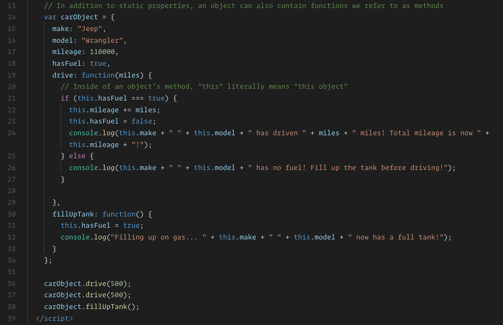

# Object Methods

## Instructions

* Explain to the class that an object's properties can be any type of value we can store in a regular variable. This includes numbers, strings, booleans, even other objects!

* Object properties can also contain functions. We refer to functions that exist on an object as **methods**.

* Open [index.html](index.html) in your web browser and demonstrate the console output for the class. 

  

* Now open [index.html](index.html) in your code editor and demonstrate the code.

  

* Point out that this is similar to the car object we worked with in a previous example, but with a few changes. Most noticeably, a few of our object's properties are functions aka methods.

* Explain that the syntax for accessing an object's methods are the same as accessing its properties: we'd write `<object-name>.<object-property>`.

* Point out that inside of an object's method, we'll often want to refer to other properties or methods which exist on the object. For example, according to our program so far, whenever the car's `drive` method is called, the car's `mileage` and `hasFuel` properties should update.

* Explain that we can access an object's own properties inside of a method using the `this` keyword. While inside of an object's method, `this`, refers to the object the method belongs to.

* In this case, inside of the `drive` method, `this.hasFuel` is equivalent to `carObject.hasFuel`. 

* Go through each method and call out students to answer what each property used on `this` should refer to and it's value at each step of the program.

