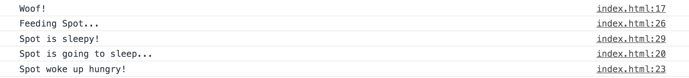
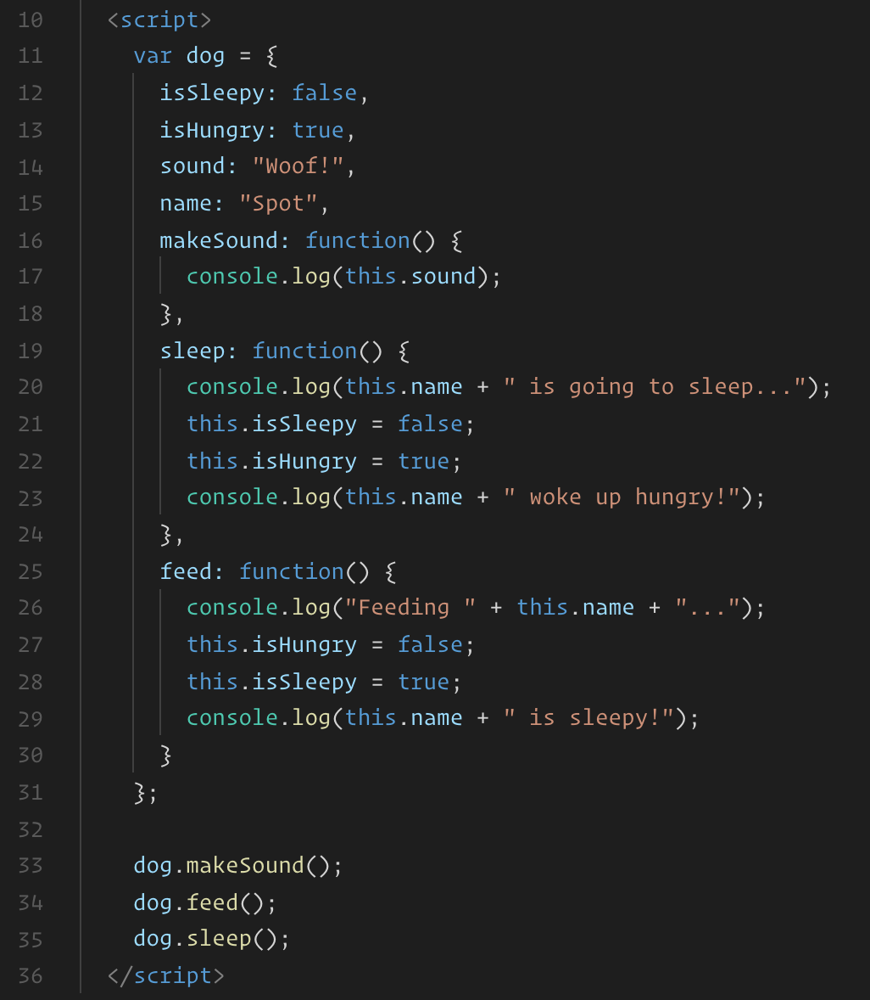

# Dog Object

## Instructions

* Once time's up open the [solution](Solved/index.html) and demonstrate the output in the console.

  

* Then open up the solution in your editor and walk through each new piece of code.

  

* Once more, the main aspects to highlight here are:

  * Object properties can be anything we can store into a regular variable.

  * We refer to object properties which are functions as methods.

  * Inside of a method, we can refer to the object it belongs to with the `this` keyword.

* Take a few moments to answer any remaining questions.
