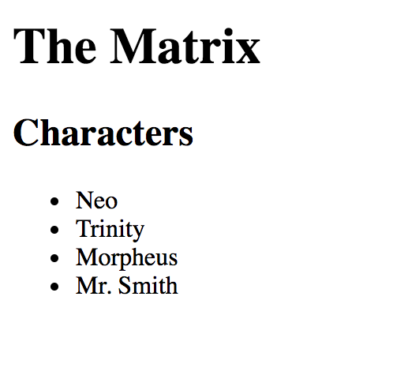
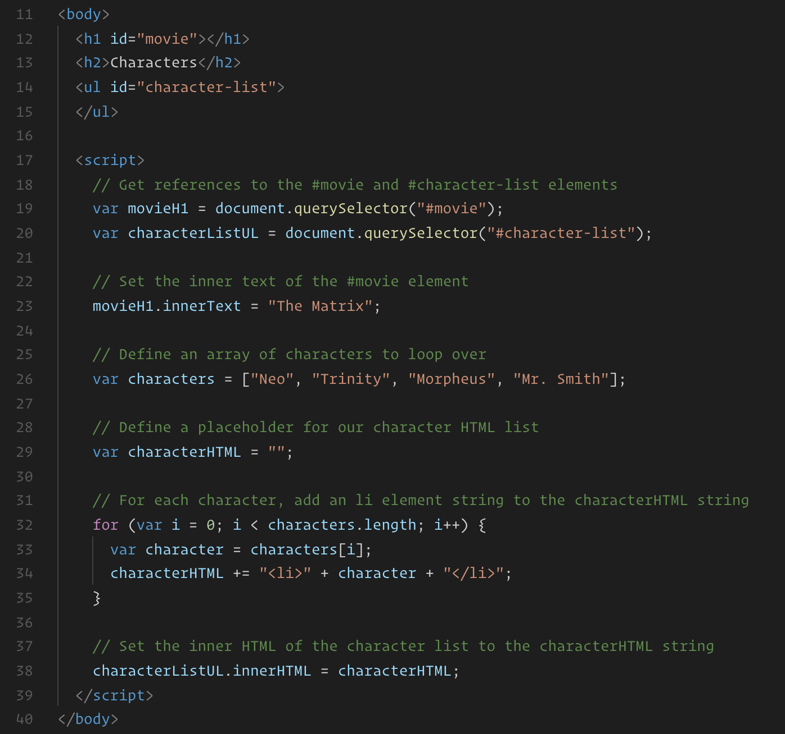

# DOM

## Instructions

* Explain to the class that now that we've learned how to implement some basic programming logic with JavaScript, we can getting into one of the more interesting and fun aspects: working with the DOM.

* Remind the class that the **D**ocument **O**bject **M**odel is the model web browsers use to represent the page that should be rendered in the browser.

* We can observe a visual representation of the DOM when we open the `Elements` tab in Devtools.

* Along with being available to display what is being rendered by the browser, the DOM exposes various JavaScript APIs which allow us to read and write information to it. This means we can update the page being rendered in a web browser on the fly, making our websites more dynamic and able to respond to user interaction.

* Inform the class that any time a website has any kind of interactivity, JavaScript is likely involved.

* Open [index.html](index.html) in your web browser and demonstrate the rendered page.

  

* This example displays an H1 tag displaying the name of a movie, along with a list of character names.

* Now open the code in your editor and go through it line by line as a class.

  

* Explain that `document` is an object that is built-in to JavaScript that contains propertie and methods for modifying te DOM.

  * The `document` object has a `querySelector` method that can be used to obtain a reference to an element in the DOM. It expects one string argument: the selector of the element it should look for. 

    * Explain that the "selectors" we'd use to query an element in the DOM using JavaScript are the same as the ones we'd use to apply CSS styles.

* Inform the class that a reference to a DOM element returned by the `document.querySelector` method is also a JavaScript object, much like the ones we've created and worked with so far. These DOM objects come with predefined properties and methods that we can use to modify how they are rendered to the page.

* Point out how we're setting the inner text of the element with a selector of `#movie`.

  * Explain that `innerText` is a property available on all DOM objects and is used for setting the text inside of an element. 

  * Demonstrate this by modifying the text it is being set to and refreshing your browser.

* Next demonstrate how the list is being rendered. The most important aspects to highlight are:

  * We're building a string containing the HTML to be inserted inside of the element with a selector of `#character-list`.

  * We're setting the `innerHTML` property, rather than the `innerText` property in this case.

* Explain that `innerHTML` differs from `innerText` in that it can be used to update all of the content inside of an element, text and HTML tags as strings.

* Take a moment to answer any questions before moving on to the next activity.
