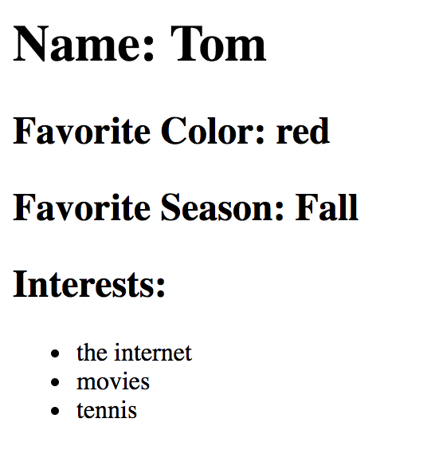
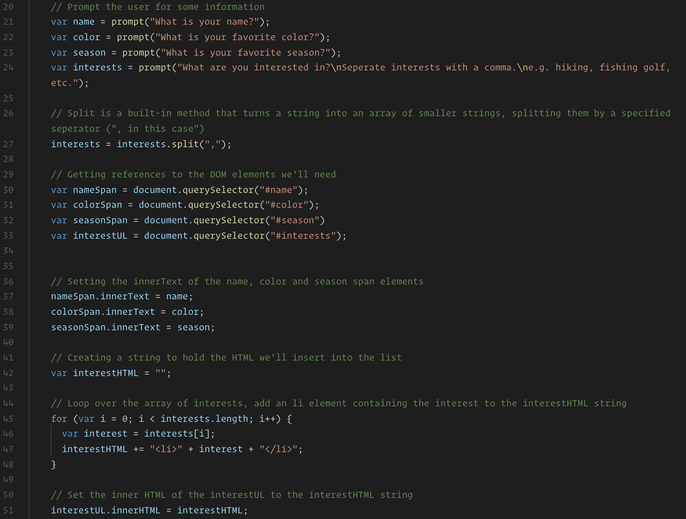

# DOM

## Instructions

* Open the [solution](Solved/index.html) in your web browser and fill in the prompted values and demonstrate how the page updates to reflect these once complete.

  

* Open the code in your editor and go through the code.

  

  * Most importantly point of the following:

  * We can use the `document.querySelector` method to obtain a reference to an element in the DOM. Since this reference is a JavaScript object, we can store it in a variable to be used later.

  * We can update an element's inner text simply by updating it's `innerText` property.

  * The `innerHTML` property is similar to `innerText`, but can be used to update all of the HTML inside of an element, rather than just the text. We're using this to insert new `li` elements inside of the unordered list.
