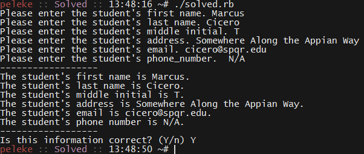
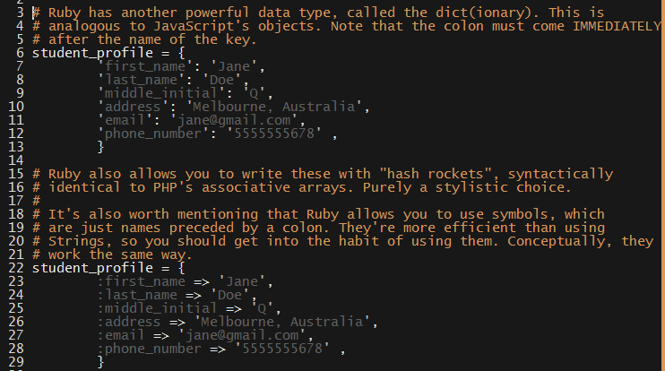
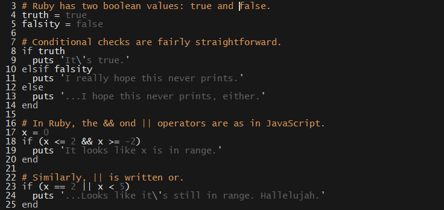
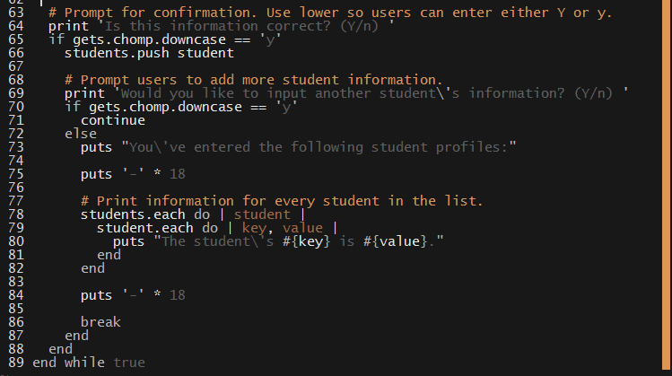
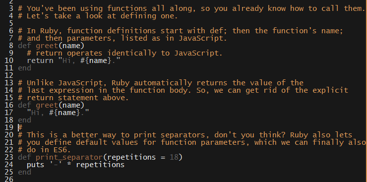
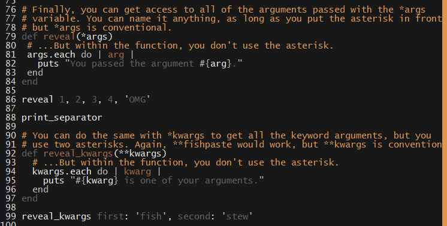
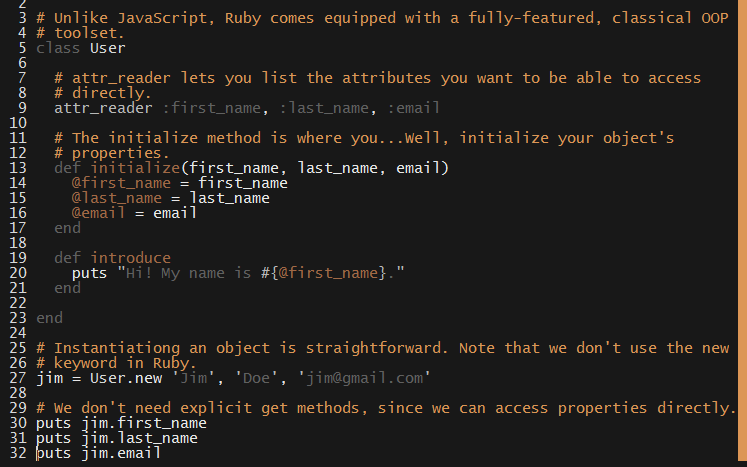
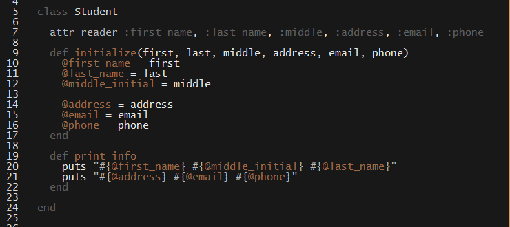
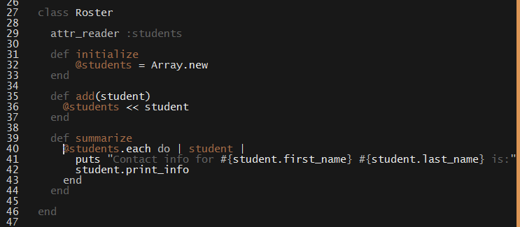
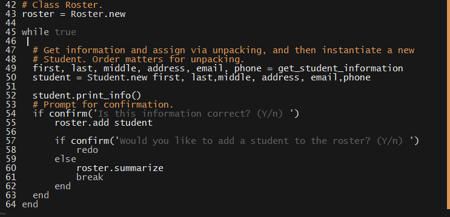

# 23.1 Lesson Plan - First Steps with Ruby

### Overview

**Note: Not all lesson plans are applicable in all markets, please check your syllabus to confirm.**

The purpose of this lesson is to provide students with basic facility in the Ruby programming language.

`Summary: Complete activities 1-4 in Unit 23`

#### Instructor Priorities

* Ruby-specific learning objectives include:

  * Given a functional installation of Ruby 2.x, students should be able to:

    * Use blocks in combination with each statements for succinct iteration.

#### Instructor Notes

* Three hours is not enough time to provide more than cursory coverage of the language, and entails numerous omissions of essential concepts. These omissions are known and intentional. The point is that students should get enough to continue to experiment with the language. This will be "most of the language", and that is fine.

* Installing Ruby is not always quick. Installation on Ubuntu 14.04 via `rbenv` and `ruby-build` took upwards of an hour, for instance. Mac and Windows users are not likely to experience such build times, but you should slack out the `Supplements/InstallationInstructions.pdf`, nonetheless.

* It may be easier to keep the example files open in one window, and demonstrate their examples in **Everyone Do** style in an interpreter on the projector.

* Have your TAs refer to the [Time Tracker](01-Day-TimeTracker.xlsx) to stay on track.

### Class Objectives

* After class, students should be able to:

  * Install Ruby on either a Windows or Mac computer; and

  * Create a terminal-based application using the basic features of the language.

- - -

### 1. Everyone Do: Verify Ruby Installation (0:05)

* Welcome students to class, and explain that today's lesson will be a "crash course" in Ruby.

* Have everyone fire up a terminal and execute the following command.

  * Run: `ruby -v`

_Ruby version output._

* For class, students should be running Ruby 2.x.x.

  * This should pose no problems, as students were instructed to install the correct version of Ruby as part of last week's lesson via the `Supplements/InstallationInstructions.pdf`.

  * Regardless, you should expect to troubleshoot. Have your TAs available and reserve a few minutes for this purpose.

### 2. Instructor Do: Data Types In Ruby (0:10)

* Open up `01-Console-IO/Examples/examples.rb`

* Explain that, like JavaScript, Ruby does _not_ require you to declare variable "types". Unlike JavaScript, Ruby doesn't even require that you annotate variable declarations with `var`, `let`, or `const`—simply choose your variable's name, and assign its value.

_Very Ruby variable declaration._

* Emphasize that we can store both strings and numbers without any special syntax—Ruby figures out the type of the data and handles it accordingly.

* Point out that Ruby has all of the same mathematical operators that JavaScript has, with one high-frequency addition: Exponentiation using `**`.

_Exponentiation in Ruby._

* Explain the `puts` and `print` functions.

  * Explain that we'll talk about functions in greater detail later, but for now, students can simply take this one "at face value". For now, just point out that we call them just as we do in JavaScript: With the function name, parentheses, and a comma-delimited list of arguments.

  * Point out the difference between `puts` and `print`—namely, that the former inserts a newline and the latter does not.

_Ruby's puts and print functions._

* Point out that we can declare more complex data types—including arrays and maps—but that we'll get some practice with these basics first.

* Finally, demonstrate the use of the `gets` and `chomp` functions.

  * Explain that `gets` waits for user input, and `chomp` strips trailing spaces and newline characters.

_Ruby's gets and chomp functions._

### 3. Students Do: Echo Student Profiles To Console (0:10)

* Slack out the `01-Console-IO-Ruby/Examples/examples.rb` so students can refer to it as they work through the exercise.

* Slack out the `01-Console-IO-Ruby/Unsolved/unsolved.rb` file to students. It contains instructions, so you don't need to slack these out separately.

### 4. Instructor Do: Review Activity  (0:10)

* Open up `01-Console-IO-Ruby/Solved/solved.rb`. This activity is fairly straightforward, and is mainly intended to help students get some practice with Ruby's syntax.

* Ask a student how they were able to save student profile information.

  * They should respond that they used `get`, or `gets.chomp`.

* Ask a student how they printed the information to the console.

  * This is a straightforward use of `print` or `puts`.

* Take any student questions. If none remain, move on to the next section.

_Console-based student profile prompts._

### 5. Instructor Do: Lists, Dictionaries, & Conditionals (0:15)

* This section will introduce students to the basic uses of arrays, hashes, and conditional statements in Ruby.

  * The primary objective is to get students familiar with the syntax. Demonstrate it, then move on. The activity affords ample practice opportunity.

* Open up `02-Arrays-Hashes-Conditions-Ruby/Examples/array_examples.rb`.

* First, explain that Ruby allows us to create and index into arrays much the same way that JavaScript does.

  * Point out that we can use negative indices in Ruby, to index starting at the "back".

_Declaring and populating a simple array in Ruby._

* Next, demonstrate that you can add single elements to a list with the left shit operator method.

  * Point out that you can use either `+=` or the `concat` method to augment a list with another list.

_Appending single elements to an array, and extending it with an iterable._

* Then, demonstrate how to iterate over a list.

  * Explain that iteration requires us to call the `each` method on the array.

  * Explain the `do | #{var} | ... end` syntax..

    * Explain that Ruby organizes code into "blocks", delimited by a starting keyword and `end`.

    * Explain that the | #{var} | syntax allows us to specify the variable we use to refer to the _current element_ during the iteration.

    * Point out that we can shorten `do | #{var} | ... end` to `{ | #{var} | ... }` for shorter statements.

_Using the each method to iterate a list._

* Slack out the [examples file](../../../../23-other-languages/01-Activities/02-Arrays-Hashes-Conditions-Ruby/Examples/array_examples.rb) file for student reference.

* Open up the `02-Arrays-Hashes-Conditions-Ruby/Examples/hash_examples.rb`.

* Begin by pointing out that Ruby's hashes are conceptually identical to JavaScript's objects, in the sense that they allow us to associate a _key_ with a _value_.

* Point out the similarity between the literal definition of a Ruby hash and a JavaScript object.

_Ruby hashes look very similar to JavaScript's objects._

* Demonstrate how to retrieve the value of a key.

  * Point out that this is very similar to retrieving a key's value from a JavaScript object using bracket notation.

  * The only difference is that, in Ruby, we use _symbols_. These are like strings, but instead of being "wrapped in quotes", they're :preceded_by_colons.

_Ruby's syntax for retrieving the value of a hash key._

* Demonstrate how to iterate over a hash.

  * Point out that this is almost identical to iterating over an array—the only difference is that we name both _key_ and _value_ variables in the definition of our `do` block.

_Iterating over a hash's items._

* Slack out the `02-Arrays-Hashes-Conditions-Ruby/Examples/hash_examples.rb` for student reference.

* Finally, open up the `02-Arrays-Hashes-Conditions-Ruby/Examples/conditionals_examples.rb`.

* Point out that Ruby's boolean values are `true` and `false`.

* Explain that Ruby's `if`, `elsif`, and `else` are conceptually identical to JavaScript's `if`, `else if`, and `else`. The only difference is that it's syntactically more compact in Ruby.

_Using if, elsif, and else in Ruby._

* Finally, point out the `while true` trick, as well as the function of `break` and `continue`.

  * Give some context. Explain that an infinite loop makes sense if you'd like to wait for an indefinite period of time _until_ something happens—e.g., until a user inputs a certain value, etc.

  * There's another syntax for this in Ruby: `begin ... end while true`. The example solution uses this structure, so you can demonstrate it now, or simply show it off later as an alternative option.

  * Let students know they'll need this for their activity!

_Using while true; continue; and break._

* Slack out the `02-Arrays-Hashes-Conditions-Ruby/Examples/conditionals_examples.rb` for student reference.

* Students are likely to be a bit overwhelmed by all the new syntax. Reassure them that this is natural, and that muscle memory comes with practice...Which the next activity will give them ample amounts of.

### 6. Partners Do: Indefinite Student Profiles  (0:15)

* Slack out the `02-Arrays-Hashes-Conditions-Ruby/Unsolved/unsolved.rb`. The file contains instructions, so there is no need to slack them out separately.

### 7. Instructor Do: Review Activity  (0:10)

* Open up the `02-Arrays-Hashes-Conditions-Ruby/Solved/solved.rb`.

* Ask a student to explain how they wrapped their code in an infinite loop.

  * They should respond that they wrapped everything in a `while True` loop.

* Ask a student to explain how they stored students in an array.

* Ask a student to explain how they stored values directly in a "student dictionary".

_Declaring a list to store students; creating a new dictionary for each student; and wrapping the entire script in an infinite loop._

* Ask another student to explain how they implemented the confirmation prompts.

  * This isn't as straightforward an answer as the previous one, so let students share their solutions, and then comment on them with reference to the solution implementation.

* Ask a student to explain how they allowed users to enter either `Y` or `y` to confirm the information they entered.

  * Demonstrate the `downcase` method in the interpreter, and point out how it was used in the solution.

_Implementing confirmation prompts and adding students to the list._

* Take a moment to answer any outstanding student questions before the break.

- - -

### 8. Break (0:15)

- - -

### 9. Instructor Do: Functions  (0:20)

* Open up `03-Functions-Ruby/Examples/examples.rb`.

* Explain that we define functions in Ruby with the `def ... end` keyword.

  * The basic form is: `def function_name(parameter, list, here) ... end`.

  * Explain that Ruby automatically returns the value of the last expression evaluated in a function body.

* Then, demonstrate how to call a function.

* Next, point out that Ruby allows us to use default arguments.

  * Feel free to point out that ES6 allows this, as well.

_Defining and calling functions, and using default arguments._

* Next, demonstrate Ruby's keyword arguments.

  * Emphasize that these allow us to define functions whose arguments are passed by _name_, rather than by position.

_Keyword arguments allow us to use name function parameters._

* Finally, demonstrate how to get access to all of the positional or keyword arguments passed to a function.

_Retrieving all arguments passed to a function._

* Slack out the `03-Functions-Ruby/Examples/examples.rb` for student reference.

### 10.  Students Do: Refactor Student Information Tool  (0:15)

* Slack out the `03-Functions-Ruby/Unsolved/unsolved.rb`. Instructions are included in the file, so there is no need to slack them out separately.

### 11.  Instructor Do: Review Activity  (0:10)

* First, ask if anyone managed to figure out how to use modules.

  * Reassure students that it's okay if they didn't!

  * If someone did, ask them to explain how they used them.

* Point out that keeping all of your helper functions defined inside of the script gets very cluttered, very quickly.

  * Explain that it would be better to extract this into a separate file.

  * Explain that this is exactly what modules allow us to do.

* Briefly open up the `03-Functions-Ruby/Solved/helpers.rb`.

  * Point out that this file has a lot of function definitions.

  * Explain tha that we'll look at them in detail momentarily.

  * For now, point out the `module Helpers ... end` syntax..

    * Explain that this creates a `module`—that is, a collection of functions grouped under a namespace—that we can use in any other Ruby file.

  * Close the file, and open up `03-Functions-Ruby/Solved/solved.rb`

  * Explain the `require './helpers'` syntax.

    * Explain that this directs Ruby to "import" the code from the file called `helpers.rb`.

    * Explain that the line `include Helpers` allows us to refer to the functions in `helpers.rb` directly.

      * Without this line, we would have to write, for example, `Helpers.get_student_information`.

* Return to the `03-Functions-Ruby/Solved/helpers.rb`.

* Ask students to explain their implementations for each of the functions required by the solution. Namely:

  * `get_student_information`;

  * `create_student`;

  * `print_student`;

  * `confirm`; and

  * `print_summary`.

* Walk through the reference solution as students explain their solutions; or, simply explain the reference solutions, if you feel pressed for time.

* Open up the `03-Functions-Ruby/Solved/solved.rb`, and discuss how these functions are used.

  * Don't feel obligated to spend too much time, here. The primary objective for this activity is getting students to define the helper functions. You're free to review the solution directly if you feel students have a good grasp of function definitions.

* Slack out the `03-Functions-Ruby/Solved/solved.rb` for student reference.

### 12.  Instructor Do: Classes & Objects  (0:15)

* Explain that, like JavaScript, Ruby is an object-oriented language.

* Explain that, unlike JavaScript, Ruby supports classical object-oriented programming.

* Open up the `04-Classes-and-Objects-Ruby/Examples/examples.rb`.

* Explain the significant syntax for defining classes in Ruby. In particular:

  * The `class` keyword;

  * The significance of the `initialize` method;

  * The use of `@` inside of instance methods;

  * The use of `attr_reader :attribute, ...`;

  * The syntax for instantiating an object, which uses `ClassName.new` rather than `new ClassName`, as in JavaScript.

_The basics of class-based OOP in Ruby._

* Slack out the `04-Classes-and-Objects-Ruby/Examples/examples.rb` for student reference.

### 13.  Students Do: Create A Student Class (0:20)

* Slack out the `04-Classes-and-Objects-Ruby/Unsolved/unsolved.rb`. The file contains instructions, so there is no need to slack them out separately.

### 14.  Instructor Do: Review Activity  (0:10)

* Ask a student to explain how they implemented their `Student` class.

  * Check their response against your reference Student class in `04-Classes-and-Objects-Ruby/Solved/StudentUtils.rb`.

_The reference solution for Student.rb._

* Ask if anyone got as far as implementing a `Roster` class.

  * If so, ask them to explain how they implemented it.

  * Check their response against your reference Roster class in `04-Classes-and-Objects-Ruby/Solved/StudentUtils.rb`.

_The reference solution for the Roster class._

* Ask a student to explain how they included `Student` and `Roster` in their solution.

  * Explain that it's perfectly acceptable to include each separately.

  * Regardless, explain that, since they're related classes—`Roster` is meant to be used with `Student`—it also makes sense to group them into a module.

  * Briefly show the `StudentUtils` class, as an alternative to requiring the `Student` and `Roster` classes independently.

* Finally, ask someone to walk through how they restructured the logic of their main program.

  * Step through the `04-Classes-and-Objects-Ruby/Solved/solved.rb`.

  * Point out how much more succinct and readable this has become, in comparison to the first script we wrote in the beginning of class.

_Our student profile script, well on the way to being satisfactorily well architected._

* Slack out the solution files for student reference.

* If time remains, foster discussion about the code students have written.

  * Ask a row if they can think of any ways to improve the structure of this program further.

  * When they respond, ask another row to critique the ideas, with questions like:

    * Can you think of something better?

    * What's good about these suggestions?

    * What Ruby structures would you use to implement these suggestions?

  * If there's time, have students try to improve their code. Otherwise, spend time discussing these questions and answering student questions.
